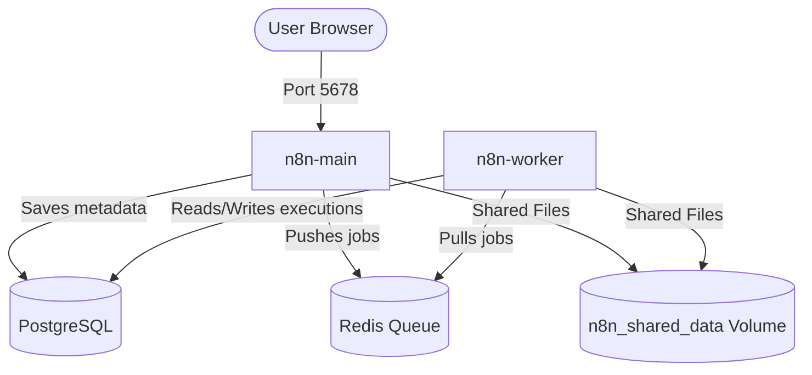

# Design Specification: n8n Queue Mode on Localhost

This document outlines the architecture, configuration, and setup steps for running n8n in Queue Mode on a local machine using Docker Compose.

## 1. System Architecture

The architecture consists of four distinct containers:



### Components
*   **n8n-main**: Handles the Web UI, API, webhook listening, scheduler, and coordination. Runs on port `5678`.
*   **n8n-worker**: Dedicated worker process that executes the actual workflow nodes. It subscribes to Redis to receive jobs.
*   **PostgreSQL**: The primary relational database containing system settings, workflows, credentials, and execution history.
*   **Redis**: In-memory message broker used by n8n (via Bull) to handle queuing and worker task distribution.

## 2. Directory Structure

The project files will be structured as follows under the root `d:\n8n`:

```
d:\n8n\
├── docker-compose.yml
└── .env
```

## 3. Configuration Details

### `.env` File
This file will contain configuration variables to avoid hardcoding secrets.
*   `POSTGRES_USER`: Database username
*   `POSTGRES_PASSWORD`: Database password
*   `POSTGRES_DB`: Database name
*   `N8N_ENCRYPTION_KEY`: A unique random key to encrypt credentials inside the database.

### `docker-compose.yml`
This file defines:
- The four services (`postgres`, `redis`, `n8n-main`, `n8n-worker`).
- Docker volumes for database and shared files.
- Port routing.

## 4. Verification Plan

After launching the docker compose system:
1.  **UI Access**: Check if the n8n UI is accessible at `http://localhost:5678`.
2.  **Queue Execution**: Create a simple workflow with a delay/execution node and run it. Verify that the execution completes successfully.
3.  **Scaling Test**: Run `docker compose up --scale n8n-worker=2 -d` to verify worker scaling.
